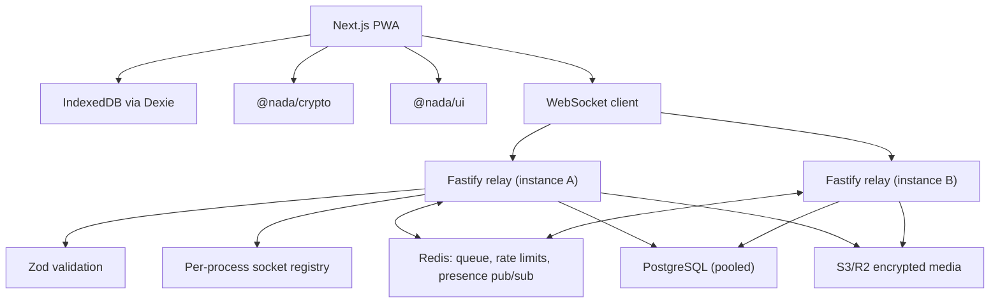

# NADA Architecture

NADA is a local-first anonymous messaging PWA. Identity is an Ed25519 keypair
generated client-side from a 12-word BIP39 seed phrase. The server routes opaque
WebSocket envelopes by public-key hash and does not own contact lists or
plaintext messages.



## Horizontal Scaling

The socket registry is per-process, so a sender on one instance cannot see a
recipient connected to another. Redis pub/sub closes that gap: each instance
subscribes to a channel per locally-connected identity, and a send that finds no
local socket publishes to the recipient's channel. `PUBLISH` returns the number
of receiving instances, which is what makes "offline everywhere, queue it" a
safe conclusion rather than a guess.

Redis carries three responsibilities, all of which must be shared:

| Concern | Why it cannot be per-process |
| --- | --- |
| Offline envelope queue | An in-memory queue loses envelopes on restart and is invisible to other instances |
| Rate-limit counters | Per-process counters let N instances allow N times the limit |
| Presence pub/sub | Without it, cross-instance messages are misfiled as "recipient offline" |

Postgres access goes through one pooled handle per process, shared by every
repository. Multi-statement writes (cascading deletes, tombstoning a reflection)
run inside explicit transactions, since under a pool consecutive statements are
not otherwise ordered against concurrent writers.

Rate limiting is keyed on the acting identity, falling back to client IP only
for requests that name no identity. An institution presents thousands of
students behind a handful of NAT addresses, so IP-keyed limits count a whole
campus as one client.

The PWA constructs relay URLs only from `NEXT_PUBLIC_RELAY_URL`. The relay reads
`PORT` and `ALLOWED_ORIGIN` from environment variables. PWA manifest paths are
relative, and service-worker support must not depend on a fixed deployment host.

## Message Encryption

Direct messages are sealed to the recipient's X25519 key, derived from their
long-term Ed25519 identity key, and signed inside the sealed box:

```json
{ "v": 2, "alg": "sealedbox-ed25519", "ct": "<base64 crypto_box_seal>" }
```

The sealed payload carries the body, the sender's public key, a timestamp and a
detached Ed25519 signature over `nada-dm:v2:<recipient hash>:<ts>:<body>`. Two
properties follow from that binding:

- The recipient learns who wrote the message *cryptographically*, rather than
  trusting the `sender` field the relay routes on.
- A captured ciphertext cannot be re-addressed to a third party or replayed into
  a different conversation: the recipient hash is inside the signature.

Group messages and status updates use one symmetric content key
(XSalsa20-Poly1305) per group epoch or per status, distributed as one sealed
copy per member. The relay stores those sealed copies opaquely and can open
none of them. For statuses the relay hands a caller only the copy addressed to
their *verified* identity, so a read requires an identity proof.

`senderPublicKey` on an envelope is how a recipient who has never seen an invite
link learns the key to encrypt a reply with. The relay rejects any envelope
whose `senderPublicKey` does not hash to the identity that socket proved it
controls, and the client re-derives the hash itself rather than trusting that
check.

### Forward secrecy (v3, prekeys)

A sealed box to a long-term identity key is confidential but permanent: whoever
later obtains that key reads everything ever sent to it. Prekeys close that.

Each identity publishes to the relay a *signed prekey* — an X25519 key signed
by its Ed25519 identity key, rotated weekly — and a batch of *one-time
prekeys*. A sender claims a bundle, verifies the signature against the
recipient's identity key, and derives a message key from the Diffie-Hellmans
between a fresh ephemeral key and the recipient's prekeys:

```
master = BLAKE2b("nada-prekey-v3" ‖ DH(EK, SPK) ‖ DH(EK, OPK)? ‖ EK ‖ SPK ‖ OPK?)
```

The recipient deletes the one-time prekey the moment it opens a message. From
then on the ciphertext cannot be reconstructed by anyone — including the
recipient, and including anyone holding the identity key.

The signature is what makes the relay storage rather than a trusted party: a
relay that substituted a prekey of its own would fail verification at the
sender.

Three fallbacks, in order, so delivery never depends on this working:

1. one-time prekey + signed prekey — forward secrecy per message;
2. signed prekey only, when an attacker has drained the one-time supply —
   forward secrecy bounded by weekly rotation;
3. v2 sealed box, when the recipient has published no prekeys at all —
   confidential, not forward-secret. The sender knows which path was taken.

### What this does not provide

- **No post-compromise security.** Prekeys are not a ratchet. An attacker with
  a device's current prekey state reads until those keys rotate.
- **No metadata protection.** The relay sees sender, recipient and timing,
  because it routes on them.
- **No server-enforced group membership.** The relay fans out to the recipient
  list the sender supplies. Rotation revokes future reading and the client only
  admits groups it was sealed a key for, but neither is membership control.
- **No recovery of queued mail across devices.** Prekey private halves are not
  derived from the seed phrase, so a restored identity cannot open messages
  queued for the device it replaced.
- **Legacy bodies.** Messages written before these formats, and peers on older
  clients, produce base64-encoded bodies. Those are still readable so history
  does not blank out, but they are marked unencrypted in the send path and the
  user is told once per conversation when a key is unavailable.

### Group key epochs

Group keys are versioned. Every group message names the epoch it was encrypted
under, and members keep every epoch they have been given, so rotating forward
never blanks out history. "Reset group key" mints the next epoch and seals it
to current members only — which is the only way to revoke a leaked invite link,
since the link embeds the key. A late message from an older epoch cannot roll
the group back onto a key it has rotated away from.

## Real-Time Delivery

Sockets complete a server-issued challenge/response before any envelope is
accepted; the signed nonce is single-use per connection. After that:

- A 30s heartbeat reaps half-open sockets. Without it a dead TCP connection
  keeps holding presence and every message routed to it is reported delivered
  and lost.
- Frames are capped at 512 KiB, envelopes at 240/minute per socket, and sockets
  at 8 per identity.
- The offline queue hands envelopes to a reconnecting client without destroying
  them: they sit in an in-flight list until the writes actually land. A socket
  that drops mid-replay, or an instance that dies holding a backlog, replays on
  the next connection instead of losing it. Delivery is at-least-once; clients
  deduplicate by envelope id.
- SIGTERM closes every socket with a close frame and drains Postgres and Redis
  before exit, so a deploy does not sever connections mid-flight.

## Health, Readiness and Observability

`/health` is liveness only — it answers from the process and deliberately does
not touch Postgres or Redis, because a load balancer must not kill every
instance over a shared-dependency blip. `/ready` probes each dependency with a
2s timeout and answers 503 when one is down; it is the endpoint for uptime
monitoring and post-deploy verification. `/stats` reports socket counts.

## Idempotency

Stripe retries every non-2xx webhook delivery and can redeliver on success, so
events are claimed by id in `stripe_events` before any work happens, and
subscriptions are keyed on the Stripe subscription id. Referral redemptions are
unique per (identity, code). Whisper notifications are deduplicated by
(recipient, actor, kind, target). Contest engagement events are deduplicated by
a deterministic key derived from the interaction itself, so a retry, a
reconnect, a second instance and the reconciliation sweep all converge on one
event and one credit.

## Schema migrations

The relay applies ordered, named migrations at boot, recording each in
`schema_migrations` inside its own transaction and behind a Postgres advisory
lock so concurrent instance starts do not race. Statements stay idempotent, so
a database predating the runner accepts the baseline migration as a no-op.

## Engagement contests

The contest engine is a first-class subsystem with its own event ledger,
scoring engine, risk engine and admin surface. Contest processing is
asynchronous and cannot block or break messaging or the feed: the Whisper
routes call a `void` emit that swallows everything. Postgres is the source of
truth; Redis only accelerates leaderboard reads. See `docs/contest-engine.md`.

## Calls

Calls use browser WebRTC APIs for media capture and peer connections. TURN
credentials are issued by the relay only after a signed identity proof, and
`TURN_SHARED_SECRET` produces per-user time-limited credentials rather than one
static pair shared by every caller. Insertable Streams support is detected but
production calling still needs an SFU plan and IP-metadata mitigations.
