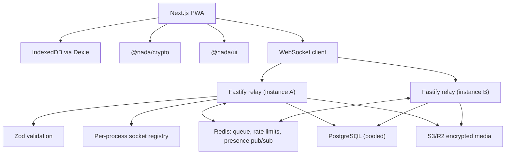

# NADA Architecture

NADA is a local-first anonymous messaging PWA. Identity is an Ed25519 keypair
generated client-side from a 12-word BIP39 seed phrase. The server routes opaque
WebSocket envelopes by public-key hash and does not own contact lists or
plaintext messages.



## Horizontal Scaling

The socket registry is per-process, so a sender on one instance cannot see a
recipient connected to another. Redis pub/sub closes that gap: each instance
subscribes to a channel per locally-connected identity, and a send that finds no
local socket publishes to the recipient's channel. `PUBLISH` returns the number
of receiving instances, which is what makes "offline everywhere, queue it" a
safe conclusion rather than a guess.

Redis carries three responsibilities, all of which must be shared:

| Concern | Why it cannot be per-process |
| --- | --- |
| Offline envelope queue | An in-memory queue loses envelopes on restart and is invisible to other instances |
| Rate-limit counters | Per-process counters let N instances allow N times the limit |
| Presence pub/sub | Without it, cross-instance messages are misfiled as "recipient offline" |

Postgres access goes through one pooled handle per process, shared by every
repository. Multi-statement writes (cascading deletes, tombstoning a reflection)
run inside explicit transactions, since under a pool consecutive statements are
not otherwise ordered against concurrent writers.

Rate limiting is keyed on the acting identity, falling back to client IP only
for requests that name no identity. An institution presents thousands of
students behind a handful of NAT addresses, so IP-keyed limits count a whole
campus as one client.

The PWA constructs relay URLs only from `NEXT_PUBLIC_RELAY_URL`. The relay reads
`PORT` and `ALLOWED_ORIGIN` from environment variables. PWA manifest paths are
relative, and service-worker support must not depend on a fixed deployment host.

## Phase 1 Security Boundary

`ciphertext` is required on every message envelope. In development, the client
also sends `devPlaintext` for the two-tab demo.

```ts
// ⚠️ MVP_ONLY — replace before production
```

Phase 2 replaces mock encryption with Signal protocol WASM, X3DH, Double
Ratchet, and sealed-sender envelopes.

## Phase 2 Additions

The relay now accepts a production envelope shape:

```json
{
  "version": 1,
  "recipient": "pubkey_hash",
  "sealedSenderEnvelope": "base64",
  "capabilityToken": "optional_signed_token"
}
```

Offline production envelopes are queued through Redis when `REDIS_URL` is
provided. Without Redis, the relay uses an in-memory queue for local development
only. File attachments are encrypted client-side with AES-GCM before any blind
upload request is made.

## Phase 3 Additions

Groups are represented as local chat records with member public-key hashes and a
group sender-key package. The Phase 3 group sender-key implementation is a
libsodium symmetric encryption scaffold:

```ts
// ⚠️ MVP_ONLY — replace before production
```

Production group messaging still requires audited Signal Sender Keys or MLS,
group membership change handling, key rotation, and metadata review.

Advanced message state is local-first: replies, mentions, edits, unsend, and
disappearing timers are stored in IndexedDB and rendered from local records.
Relay group messages are fan-out envelopes with recipient hashes; the relay does
not inspect plaintext.

Calls use browser WebRTC APIs for media capture and peer-connection scaffolding.
Insertable Streams support is detected, but production calling still needs TURN
and/or SFU architecture, abuse controls, and IP metadata mitigations.
