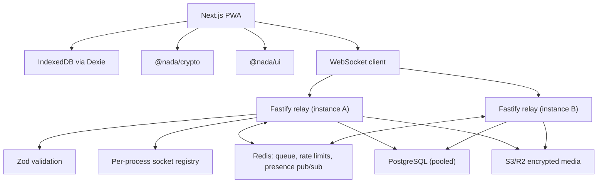

# NADA Architecture

NADA is a local-first anonymous messaging PWA. Identity is an Ed25519 keypair
generated client-side from a 12-word BIP39 seed phrase. The server routes opaque
WebSocket envelopes by public-key hash and does not own contact lists or
plaintext messages.



## Horizontal Scaling

The socket registry is per-process, so a sender on one instance cannot see a
recipient connected to another. Redis pub/sub closes that gap: each instance
subscribes to a channel per locally-connected identity, and a send that finds no
local socket publishes to the recipient's channel. `PUBLISH` returns the number
of receiving instances, which is what makes "offline everywhere, queue it" a
safe conclusion rather than a guess.

Redis carries three responsibilities, all of which must be shared:

| Concern | Why it cannot be per-process |
| --- | --- |
| Offline envelope queue | An in-memory queue loses envelopes on restart and is invisible to other instances |
| Rate-limit counters | Per-process counters let N instances allow N times the limit |
| Presence pub/sub | Without it, cross-instance messages are misfiled as "recipient offline" |

Postgres access goes through one pooled handle per process, shared by every
repository. Multi-statement writes (cascading deletes, tombstoning a reflection)
run inside explicit transactions, since under a pool consecutive statements are
not otherwise ordered against concurrent writers.

Rate limiting is keyed on the acting identity, falling back to client IP only
for requests that name no identity. An institution presents thousands of
students behind a handful of NAT addresses, so IP-keyed limits count a whole
campus as one client.

The PWA constructs relay URLs only from `NEXT_PUBLIC_RELAY_URL`. The relay reads
`PORT` and `ALLOWED_ORIGIN` from environment variables. PWA manifest paths are
relative, and service-worker support must not depend on a fixed deployment host.

## Message Encryption

Direct messages are sealed to the recipient's X25519 key, derived from their
long-term Ed25519 identity key, and signed inside the sealed box:

```json
{ "v": 2, "alg": "sealedbox-ed25519", "ct": "<base64 crypto_box_seal>" }
```

The sealed payload carries the body, the sender's public key, a timestamp and a
detached Ed25519 signature over `nada-dm:v2:<recipient hash>:<ts>:<body>`. Two
properties follow from that binding:

- The recipient learns who wrote the message *cryptographically*, rather than
  trusting the `sender` field the relay routes on.
- A captured ciphertext cannot be re-addressed to a third party or replayed into
  a different conversation: the recipient hash is inside the signature.

Group messages and status updates use one symmetric content key
(XSalsa20-Poly1305) per group epoch or per status, distributed as one sealed
copy per member. The relay stores those sealed copies opaquely and can open
none of them. For statuses the relay hands a caller only the copy addressed to
their *verified* identity, so a read requires an identity proof.

`senderPublicKey` on an envelope is how a recipient who has never seen an invite
link learns the key to encrypt a reply with. The relay rejects any envelope
whose `senderPublicKey` does not hash to the identity that socket proved it
controls, and the client re-derives the hash itself rather than trusting that
check.

### What this does not provide

- **No forward secrecy.** There is no ratchet. Whoever later obtains an
  identity private key can decrypt every ciphertext ever sent to it. Signal
  session support remains behind the adapter boundary in `@nada/crypto`.
- **No metadata protection.** The relay sees sender, recipient and timing,
  because it routes on them.
- **No automatic group key rotation.** A removed member keeps the sender key
  they already hold until the group rotates. Group invite links still carry the
  group key, so the link is the group credential.
- **Legacy bodies.** Messages written before this format, and peers on older
  clients, produce base64-encoded bodies. Those are still readable so history
  does not blank out, but they are marked unencrypted in the send path and the
  user is told once per conversation when a key is unavailable.

## Real-Time Delivery

Sockets complete a server-issued challenge/response before any envelope is
accepted; the signed nonce is single-use per connection. After that:

- A 30s heartbeat reaps half-open sockets. Without it a dead TCP connection
  keeps holding presence and every message routed to it is reported delivered
  and lost.
- Frames are capped at 512 KiB, envelopes at 240/minute per socket, and sockets
  at 8 per identity.
- The offline queue hands envelopes to a reconnecting client without destroying
  them: they sit in an in-flight list until the writes actually land. A socket
  that drops mid-replay, or an instance that dies holding a backlog, replays on
  the next connection instead of losing it. Delivery is at-least-once; clients
  deduplicate by envelope id.
- SIGTERM closes every socket with a close frame and drains Postgres and Redis
  before exit, so a deploy does not sever connections mid-flight.

## Health, Readiness and Observability

`/health` is liveness only — it answers from the process and deliberately does
not touch Postgres or Redis, because a load balancer must not kill every
instance over a shared-dependency blip. `/ready` probes each dependency with a
2s timeout and answers 503 when one is down; it is the endpoint for uptime
monitoring and post-deploy verification. `/stats` reports socket counts.

## Idempotency

Stripe retries every non-2xx webhook delivery and can redeliver on success, so
events are claimed by id in `stripe_events` before any work happens, and
subscriptions are keyed on the Stripe subscription id. Referral redemptions are
unique per (identity, code). Whisper notifications are deduplicated by
(recipient, actor, kind, target).

## Calls

Calls use browser WebRTC APIs for media capture and peer connections. TURN
credentials are issued by the relay only after a signed identity proof, and
`TURN_SHARED_SECRET` produces per-user time-limited credentials rather than one
static pair shared by every caller. Insertable Streams support is detected but
production calling still needs an SFU plan and IP-metadata mitigations.
